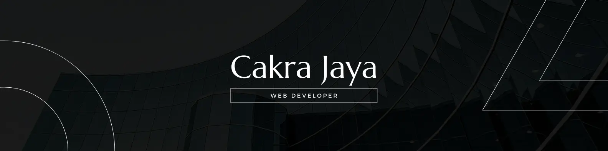

<h1 align="center">Hi 👋, I'm Cakra Jaya</h1>
<h3 align="center">Web Developer</h3>

I am a student at ITB Stikom Bali majoring in Information Systems and a Web Developer at TempatKita Software, I like learning new things to increase my skills and knowledge

- 👨‍💻 My Portfolio Website https://cakra-portfolio.my.id/

## 🌐 Connect With Me:

  
  
  

# 💻 Tech Stack:

# 📊 GitHub Stats:

---

<!-- Proudly created with GPRM ( https://gprm.itsvg.in ) -->

